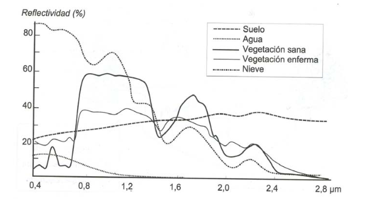
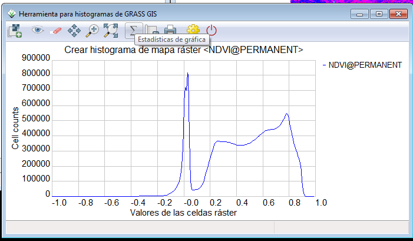

.. taller SIGTE documentation master file, created by
   sphinx-quickstart on Fri Jan 30 18:35:02 2015.
   You can adapt this file completely to your liking, but it should at least
   contain the root `toctree` directive.

:tocdepth: 2

====================
TALLER TELEDETECCIÓN
====================

Instructor: Josep Sitjar, Alexandre Busquets (SIGTE – Universitat de Girona)

El taller se centrará fundamentalmente en descubrir las potencialidades de la teledetección como fuente de datos esencial en los SIG.
Se hará una breve introducción al proceso de adquisición de imágenes de satélite en función de la plataforma (Landsat, Spot…) y de los sensores encargados de realizar la observación, así como de los principales aspectos a tener en cuenta al trabajar con estas imágenes. Mostraremos algunos de los principales portales disponibles para la descarga de imágenes de satélite.
Son muchas las herramientas que ofrece el software GRASS GIS para el trabajo con imágenes de satélite, con lo que buena parte del taller se centrará en descubrir algunos de los principales módulos de este software y el flujo de trabajo para desarrollar un proyecto de teledetección: desde la visualización al análisis, pasando también por los correspondientes procesos de corrección.
Finalmente, se desarrollarán algunos scripts en Python para el establecimiento de rutinas de análisis de los datos obtenidos.

.. contents::
   :depth: 2
 

¿Qué es la teledetección?
==========================
El término teledetección hace referencia a las distintas formas de adquirir información de forma remota a través
de sensores sin entrar en contacto físico con el objeto. Los sensores se localizan en plataformas de observación (bien en aviones o satélites), y registran la información centrada en las regiones del espectro electromagnético. La teledetección tiene como objetivo
obtener las características de la superficie observada y los fenómenos que en ella tienen lugar. Distintas disciplinas se sirven de
esta fuente de información (meteorología, oceanografía, geología, geografía,...), por lo que esta nueva forma de ver nuestro planeta viene acompañada por el desarrollo de potentes modelos físico-matemáticos que tratan de describir los procesos físicos que tienen lugar en nuestro entorno.

.. figure:: img/tele1.jpeg
   :align:  center
   :width: 450pt

Fundamentos de la teledetección
_______________________________

.. figure:: img/tele8.png
   :align:  center
   :width: 250pt

   Esquema de un sistema de teledetección. Fuente: V.Olaya. 

a) **Fuente de radiación** (puede ser natural) o artificial. La primera de ellas es la forma más importante de teledetección, pues se deriva directamente de la luz solar, principal fuente de energía del plantea. El sol ilumina la superficie terrestre, que refleja esa energía en función del tipo de cubierta presente sobre ella. Este flujo reflejado se recoge por el sensor, que lo transmite posteriormente a las estaciones receptoras.

b) **Objetos** que interaccionan con la radiación o la emiten. 

c) **Atmósfera** por la que se desplaza la radiación, tanto desde la fuente hasta el objeto como desde el objeto hasta el receptor. La atmósfera también interactúa con la radiación, introduciendo igualmente perturbaciones en ella.

d) **Receptor** que recoge la radiación una vez ésta ha sido perturbada o emitida por los objetos. El receptor va a generar como producto final una imagen en cuyas celdas se va a contener un valor que indica la intensidad de la radiación. Estos valores son valores enteros que indican el nivel de dicha radiación entre una escala definida (habitualmente valores entre 1 y 256), y se conocen dentro del ámbito de la teledetección como Niveles Digitales

La radiación electromagnética
_______________________________

La radiación electromagnética es una de las cuatro fuerzas fundamentales en la naturaleza, y deriva del campo electromagnético. Un cuerpo con carga, en reposo o que se mueve en el espacio, genera un campo electromagnético definido mediante dos vectores: el campo electrónico y el campo magnético. Así, se define la **radiación electromagnética** como una **combinación de campos eléctricos y magnéticos oscilantes y perpendiculares entre sí que se propagan a través del espacio transportando energía de un lado a otro**. 

   Esquema de onda electromagnética. Fuente: E. Chuvieco

Según la teoría ondulatoria, las ondas electromagnéticas se desplaza a la velocidad de la luz siguiendo un modelo armónico y continuo, y se pueden describir por dos elementos: **longitud de onda**  (λ)  y **frecuencia** (F). La primera hace referencia a la distancia entre dos tipos sucesivos de onda, mientras que la frecuencia designa el número de ciclos pasando por un punto fijo en una unidad de tiempo. Ambos elementos están inversamente relacionados: una mayor longitud de onda -y por tanto, una menor frecuencia- tiene asociada una menor energía de la radiación. 

El espectro electromagnético
____________________________

De lo mencionado hasta ahora se deduce que puede definirse cualquier tipo de energía radiante en función de su longitud de onda o frecuencia. Aunque la sucesión de valores de longitud de onda es continua, suelen establecerse una serie de bandas en donde la radiación electromagnética manifiesta un comportamiento similar. La organización de estas bandas de longitudes de onda o frecuencia se denomina espectro electromagnético, y comprende desde las longitudes de onda más cortas (rayos gamma, rayos X), hasta las Kilométricas. 

En la siguiente imagen se muestra un esquema del espectro electromagnético y sus principales regiones de interés:

.. figure:: img/tele10.png
   :align:  center
   :width: 500pt

   Espectro electromagnético y sus principales regiones de interés. Fuente: Wikipedia

La firma espectral 
____________________________

La firma espectral es el conjunto de reflectancias en las distintas longitudes de onda que presenta un objeto o material dado. Dicho de otro modo, la firma espectral es la 'huella dactilar' que caracteriza cada objeto, y que deriva directamente de sus propiedades y de cómo éstas influyen en la forma en que dicho objeto refleja la radiación incidente.

Es gracias a la información que proporcionan las firmas espectrales que es posible identificar en una imagen de satélite la naturaleza de los objetos.

Las firmas espectrales son a menudo representadas gráficamente en un eje de coordenadas, donde la longitud de onda está en el eje de las abscisas, y la reflectancia en el eje de las ordenadas. 

   Signaturas espectrales típicas de distintas cubiertas. Fuente: E. Chuvieco

.. note:: Firma espectral con GRASS

   Utilizando **i.spectral** de GRASS podéis obtener la firma espectral de una cubierta concreta.

Descarga de imágenes satélite
=============================

**Earth Explorer**. Portal para realizar consultas y adquirir imágenes de satélite, fotografías aéreas y productos cartográficos del archivo.
http://earthexplorer.usgs.gov/

**GLOVIS**, visualizador de imágenes del servicio geológico de los Estados Unidos cuenta con imágenes de varios satélites.
http://glovis.usgs.gov/

**US Geological Sourvey**, EROS Data Center, organismo que mantiene una base de datos sobre imágenes del programa Landsat.
http://eros.usgs.gov/

El programa Landsat
====================
Vamos a desarrollar el taller utilizando imágenes del satélite **Landsat**. 

Desde que a finales de la década de los 60 la agencia espacial norteamericana diseñó el primer proyecto dedicado exclusivamente a la observación de los recursos terrestres, la familia Landsat ha constituido el proyecto más fructífero de teledetección espacial desarrollado hasta el momento. 

La buena resolución de sus sensores, el carácter global y periódico de la observación que realizan y la buena comercialización, explican su profuso empleo por expertos de muy variados campos en todo el mundo. 

Con el **Landsat 8** (cuyo nombre técnico es LCDM 'Landsat Data Continuity Mission') se ha dado continuidad al programa más largo de la historia sobre información del planeta. 

El sensor OLI (Operational Land Imager)
_______________________________________

A bordo del Landsat 8, se encuentra el sensor OLI, puesto en órbita en Febrero del 2013. Las bandas espectrales capturadas por este sensor son muy parecidas a las del sensor ETM+ (a bordo del Landsat 7), aunqué se han añadido dos de nuevas: un nuevo **canal en azul visible** (banda 1) diseñado específicamente para observar la calidad del agua en lagos someros y zonas costeras, así como para detectar aerosoles, y otro **canal en el infrarrojo** (banda 9) para determinar la presencia de nubes -fundamentalmente cirrus-. 

Asimismo, junto cada escena del Landsat 8 se incluye también una banda de valoración de calidad (*Quality Assurance band*), que ofrece información respecto anomalías en la toma de datos por problemas en el instrumental o la presencia de elementos como nubes, agua y nieve. 

El sensor TIRS (Thermal Infrarred Sensor)
_________________________________________

El sensor TIRS capta información acerca la temperatura de la superficie terrestre a través de dos bandas del infrarroje térmico (banda 10 y banda 11). Permite distinguir entre la temperatura de la superficie terrestre y la temperatura atmosférica. Tienen una resolución de 100 mts. 

Las bandas del satélite Landsat 8
_________________________________

+-------+------------------------+------------+----------+
| Sensor|Band Number             | Amplitud   |Resolución|    
+=======+========================+============+==========+
| Oli   |1. Coastal aerosol      |0,43-0,45μm |30m       |  
+-------+------------------------+------------+----------+
|       |2. Blue                 |0,45-0,51μm |30m       |  
+-------+------------------------+------------+----------+
|       |3. Green                |0,53-0,59μm |30m       |  
+-------+------------------------+------------+----------+
|       |4. Red                  |0,64-0,67μm |30m       |  
+-------+------------------------+------------+----------+
|       |5. Near Infrared (NIR)  |0,85-0,88μm |30m       |  
+-------+------------------------+------------+----------+
|       |6. SWIR 1               |1,57-1,65μm |30m       |  
+-------+------------------------+------------+----------+
|       |7. SWIR 2               |2,11-2,29μm |30m       |  
+-------+------------------------+------------+----------+
|       |8. Panchromatic         |0,50-0,68μm |15m       |  
+-------+------------------------+------------+----------+
|       |9. Cirrus               |1,36-1,38μm |30m       |  
+-------+------------------------+------------+----------+
|TIRS   |10. Thermal Infrarred 1 |10,6-11,9μm |100m      |  
+-------+------------------------+------------+----------+
|       |11. Thermal Infrarred 2 |11,5-12,51μm|100m      |  
+-------+------------------------+------------+----------+

Comparativa longitud de onda de las bandas del Landsat 8 y Landsat 7:

.. figure:: img/tele12.jpg
   :align:  center
   :width: 600pt

Combinación de bandas
____________________________

Las bandas multiespectrales de una imagen de satélite pueden visualizarse mediante distintas composiciones en color. Basta por ello aplicar cada uno de los tres colores primarios (rojo, verde y azul) a una banda distinta de la imagen, seleccionada con el criterio y el orden que se estime más oportuno. 
El proceso permite visualizar simultáneamente, imágenes de distintas regiones del espectro, lo que facilita la delimitación visual de algunas cubiertas. La elección de las bandas para realizar la composición, y el orden de los colores destinados a cada una, dependen del sensor sobre el que se trabaje y de la aplicación última del proyecto.

Encontraréis algunas combinaciones posibles para Landsat 8 en: http://landsat.usgs.gov/L8_band_combos.php

.. note:: Combinación de bandas con GRASS

   Utilizad **r.composite** o **d.rgb** para realizar algunas combinaciones de bandas. 

Cálculo de la temperatura terrestre (LST) utilizando las bandas del TIRS
=========================================================================

Split-window algorithm 
_______________________

Para el cálculo de la temperatura de la superficie, se utilizará el algoritmo Split-Window (SW). Se trata del algoritmo mas utilizado para el cálculo de LST debido a su simplicidad y robustez. 

Este algoritmo se basa en el hecho que la radiación absorbida por la atmósfera es proporcional a la diferencia de brillo entre las mediciones simultáneas en dos longitudes de onda diferentes, correspondientes a las dos bandas del sensor TIRS. 

LST = TB\ :sub:`10`\ + C\ :sub:`1`\ (TB\ :sub:`10`\-TB\ :sub:`11`\ ) + C\ :sub:`2`\ (TB\ :sub:`10`\ -TB\ :sub:`11`\ )2+ C\ :sub:`0`\ +(C\ :sub:`3`\ +C\ :sub:`4`\ W) (1-ε) + (C\ :sub:`5`\ +C\ :sub:`6`\ W) ∆ ε

donde:

LST - Land Surface Temperature (Kelvin)

C\ :sub:`0`\  to  C\ :sub:`6`\ - Valores del coeficiente para SW (Skokovic et al, 2014; Sobrino et al, 1996; Shaouhua Zhao et al, 2009)

+------------+------+
| Constant   |Value |    
+============+======+
|C\ :sub:`0` |-0.268|
+------------+------+
|C\ :sub:`1` |1.378 |
+------------+------+
|C\ :sub:`2` |0.183 |
+------------+------+
|C\ :sub:`3` |54.300|
+------------+------+
|C\ :sub:`4` |-2.238|
+------------+------+
|C\ :sub:`5` |-129.2|
+------------+------+
|C\ :sub:`6` |16.400|
+------------+------+

TB\ :sub:`10`\ y TB\ :sub:`11`\ - temperatura de brillo de la banda 10 y 11 (K)

∆ - valor medio LSE (Land Surface Emissivity) de las bandas del TIR

W - contenido de vapor de agua en la atmósfera

∆ ε - Diferencia en LSE

.. seealso::
      **Estimation of Land Surface Temperature of Dindigul district using Landsat 8 Data** (2014). Rajeshwari A, Mani N D. International Journal of Research in Engineering and Technology.

Convertir los ND a valores de radiancia (TOA - Top of athmosphere)
___________________________________________________________________
 
A partir de los datos medidos por el sensor, puede obtenerse la **energía reflejada**, ya que la radiancia espectral medida por éste es consecuencia de la reflexión de la radiación electromagnética en las cubiertas. Esta reflexión se codifica con un valor numérico, que se denomina **ND**, de acuerdo a los coeficientes de calibración específicos para cada sensor. Dada que estos coeficientes son conocidos, puede realizarse el proceso inverso, obteniendo así los valores de **radiancia** espectral detectado por el sensor a partir de los ND. 

Para aplicar la fórmula del SW *algorithm*, es imprescindible conocer estos valores de radiancia. 
Las bandas del sensor OLI y TIRS pueden convertirse a valores de radiancia espectral del siguiente modo: 

Lλ = MLQcal + AL 

donde:              

Lλ = TOA spectral radiance (Watts/( m2 * srad * μm))

ML = Band-specific multiplicative rescaling factor from the metadata (RADIANCE_MULT_BAND_x, where x is the band number)
    
AL = Band-specific additive rescaling factor from the metadata (RADIANCE_ADD_BAND_x, where x is the band number)
    
Qcal = Quantized and calibrated standard product pixel values (DN)  

Conversión a valores de reflectividad aparente y temperatura de Brillo a la altura de la atmósfera (TOA)
__________________________________________________________________________________________________________

A partir de los valores de radiancia, utilizando las bandas térmicas fácilmente se puede derivar la temperatura a la altura del sensor. 
Las bandas del TIRS se pueden convertir a temperatura de brillo utilizando las constantes que figuran en el archivo de metadatos. De este modo:

donde:              

T = At-satellite brightness temperature (K)

Lλ = TOA spectral radiance (Watts/( m2 * srad * μm))

K1 = Band-specific thermal conversion constant from the metadata (K1_CONSTANT_BAND_x, where x is the band number, 10 or 11)

K2 = Band-specific thermal conversion constant from the metadata (K2_CONSTANT_BAND_x, where x is the band number, 10 or 11)

Abrid el archivo de metadatos de la imagen (.met) con un editor de texto, y comprobad que figuran todos los parámetros para el cálculo de la reflectividad: **date, sun_elevation, product_date, gain**.

.. note:: **Ejercicio 1**

   Cread un nuevo location y mapset de GRASS, utilizando el mismo SR que la imagen Landsat 8.

   Utilizad el comando **r.in.gdal** para importar todas las bandas de la imagen. 

   Utilizad **i.landsat.toar** de GRASS para obtener la temperatura de brillo a la altura de la atmósfera a partir de las bandas térmicas de la imagen.

   El método **uncorrected at-sensor values** de i.landsat.toar convierte los ND de la imagen a valores de radiancia, y posteriormente a reflectividad. Las bandas térmicas se convierten en primer lugar a valores de radiancia, y posteriormente a valores de temperatura a la altura del sensor, en grados Kelvin. 
   

  i.landsat.toar input=PREFIJO DE LAS BANDAS output=PREFIJO DE SALIDA metfile=RUTA AL FICHERO DE METADATOS sensor=oli8
   
   *Si se añade* **-r**, *se obtendrán valores de radiancia en vez de valores de reflectividad*. 

Corrección atmosférica
______________________

Este método, no obstante, **no tiene en consideración las influencias atmosféricas** y asume un **terreno plano** y una **observación vertical**, lo cual supone una simplificación de la realidad. De ahí que debamos hablar de reflectividad aparente, pues el valor calculado representa sólo la reflectividad captada por el sensor, pero no la realmente medible en la superficie. 

En cuanto a la **observación vertical**, es asumible para la mayor parte de los sensores de interés ambiental (Landsat, IRS, MOS-MESSR...), pero debe considerarse cuando la adquisición no es vertical, como ocurre con el SPOT-HRV.

Por otro lado, la influencia atmosférica no afecta por igual a los dos componentes del cálculo de la reflectividad (energía reflejada e incidente), ya que el espesor de la atmósfera que atraviesan es distinto. Además, hay que considerar que a la radiancia solar directa hay que añadir la difusa, procedente de otros objetos vecinos. 
Por ello, la radiancia que recibe el satélite no es la misma que la que sale del suelo, que es la que interesa, dado que pretendemos medir la reflectividad de la cubierta, no la influida por la atmósfera.

Existen distintos procedimientos para abordar las influencias atmosféricas, y determinar la radiancia del suelo, no la que recibe el satélite. 
Desde GRASS, disponemos del módulo **i.landsat.toar** que permite aplicar el método de corrección **DOS** (Dark Object Substraction), y **i.atcorr**, para aplicar el método **6S** (Second Simulation of Satellite Signal in the Solar Spectrum).  

Por su sencillez, utilizaremos el método DOS, que consiste en suponer que el mínimo valor de ND debe corresponder a las zonas oscuras presentes en la imagen y que en ausencia de efecto atmosférico ese valor debería ser cero. Conforme a esta suposición, se deduce que las diferencias entre el cero y los valores mínimos de los histogramas de las distintas bandas afectadas se deben al incremento de la radiancia absorbida por el sensor como consecuencia de la radiación difusa de la atmósfera. El procedimiento de corrección consiste en restar de todos los ND de cada banda, el ND mínimo de ella, de modo que se haga coincidir con el cero del origen del histograma.  

Existen algunas variantes del método de corrección atmosférica DOS (DOS1, DOS2, DOS3 y DOS4)

.. seealso::
      **Classification and Change Detection Using Landsat TM Data: When and How to Correct Atmospheric Effects** (2000). Remote Sensing Environment.

.. note:: **Ejercicio 2**

   Aplicad el método de corrección atmosférica DOS1 a las bandas de la imagen Landsat 8, dejando por defecto los valores correspondientes a **Percent of solar radiance** y **Minimum pixels to consider digital number as dark object**.

   i.landsat.toar input=PREFIX output=PREFIX metfile=ARCHIVO MET method=dos1

   El proceso puede demorarse algunos minutos. 

http://gis.stackexchange.com/questions/40531/how-to-determine-aerosol-model-value-for-i-atcorr-in-grass

Cálculo de valores de emisividad de la superficie terrestre
___________________________________________________________

Otro de los parámetros del **SW algorithm** que es necesario obtener, es el de la emissividad de la superficie terrestre. 
Para entender que es la **emisividad**, hay que hacer referencia previamente a la **emitancia**.

.. note:: Emitancia y Emisividad

   
   Se entiende por **emitancia** el total de energía radiada en todas las direcciones desde una unidad de área y por unidad de tiempo. Se mide en vatios por metro cuadrado.

   La **emisividad** es la relación entre la emitancia de una superfície (M) y la que ofrecería un emisor perfecto, denominado cuerpo negro, a la misma temperatura.

A partir de Índice de Vegetación de Diferencia Normalizada **(NDVI)** es posible derivar el valor de emisividad de las cubiertas del suelo. 

.. seealso::
      **Mapping Land Surface Emissivity from NDVI: Application to European, African, and South American Areas** (1996). Enric Valor and Vicente Caselles. Elsevier Science Inc.
 
**El índice de Vegetación de Diferencia Normalizada**

El Índice de Vegetación de Diferencia Normalizada, también conocido como NDVI por sus siglas en inglés, es uno de los índices más importantes y más ampliamente utilizados.

La fórmula para la obtención de este índice es la siguiente:

**NDVI = (IR – R) / (IR + R)**

donde R e IR son las reflectancias correspondientes al rojo (Banda 4) e infrarrojo (Banda 5) respectivamente.

Los valores resultantes de este índice se encuentran dentro del intervalo (-1,1), indicando los valores altos la presencia de vegetación. 

(NDVI < 0), correspondientes a agua o cubiertas artificiales

(0 < NDVI < 0,2), correspondientes a suelo desnudo o vegetación muerta

(0,2 < NDVI < 0,4), correspondientes a vegetación dispersa o poco vigorosa

(0,4 < NDVI < 0,6), correspondientes a vegetación abundante y vigorosa

(NDVI > 0,6), correspondientes a vegetación muy densa y vigorosa,

.. note:: **Ejercicio 3**

   Utilizad el comando de GRASS **i.vi** para el cálculo de índices de vegetación.Las bandas a utilizar serán las correspondientes al rojo (B4) y al infrarrojo (B5) corregidas atmosféricamente. 

   i.vi red=B4 corregida atmosféricamente output=NDVI viname=ndvi nir=B5 corregida atmosféricamente

   Visualizad el histograma de la imagen correspondiente al NDVI que habéis creado. Los valores debería estar entre el intervalo -1,1.

.. note:: **Ejercicio 4**

   Aplicad una paleta de color específica para la representación de capas NDVI

   r.colors map=NDVI color=ndvi

**Fractional Vegetation Cover (FVC)**
El FVC es un índice que permite estimar la fracción de superficie ocupada por vegetación, y se obtiene a partir del NDVI. 
Obtener el FVC es necesario para hallar los valores de LSE. 

.. figure:: img/tele4.png
   :align:  center
   :width: 250pt

.. note:: **Ejercicio 5**

   Utilizad la calculadora raster de GRASS para obtener el FVC
   Podéis utilizar r.info para hallar los valores mínimo y máximo de la capa NDVI.

   r.mapcalc "FVC = ((NDVI+NDVImin)/(NDVImax - NDVImin))^2"

**Land Surface Emissivity**

Finalmente, podréis obtener los valores correspondientes a LSE para las bandas del sensor TIRS (Band 10 y Band 11), teniendo en consideración que:

.. figure:: img/tele5.png
   :align:  center
   :width: 150pt

donde:

.. figure:: img/tele6.png
   :align: center
   :width: 150pt

+------------+-------+--------+
| Emissivity |Band 10|Band 11 |  
+============+=======+========+
|Soil        |0.971  |0.977   |
+------------+-------+--------+
|Vegetation  |0.987  |0.989   |
+------------+-------+--------+

Fuente: Skokovic et al, 2014; Sobrino et al, 1996; Shaouhua Zhao et al, 2009.

.. note:: **Ejercicio 6**

   Utilizad la calculadora raster de GRASS para obtener los valores LSE de las bandas 10 y 11.

   r.mapcalc "LSE_B10 = 0.971*(1-FVC)+0.987*FVC"

   r.mapcalc "LSE_B11 = 0.977*(1-FVC)+0.989*FVC"

Aplicación del Split-Window Algorithm
______________________________________

Recordad que el SW Algorithm que vamos a aplicar, es:

LST = TB\ :sub:`10`\ + C\ :sub:`1`\ (TB\ :sub:`10`\-TB\ :sub:`11`\ ) + C\ :sub:`2`\ (TB\ :sub:`10`\ -TB\ :sub:`11`\ )2+ C\ :sub:`0`\ +(C\ :sub:`3`\ +C\ :sub:`4`\ W) (1-ε) + (C\ :sub:`5`\ +C\ :sub:`6`\ W) ∆ ε

En este momento, ya únicamente nos faltan los parámetros correspondientes a:

∆ - valor medio LSE (Land Surface Emissivity) de las bandas del TIR = (LSE\ :sub:`10`\ + LSE\ :sub:`11`\) / 2

∆ ε - Diferencia en LSE = LSE\ :sub:`10`\ - LSE\ :sub:`11`\

.. note:: **Ejercicio 7**

   Utilizad la calculadora ráster de GRASS para obtener los valores correspondientes a al **valor medio LSE** y a la **diferencia en LSE**.

   El valor medio en contenido de agua puede obtenerse del sensor Modis: 
   http://en.wikipedia.org/wiki/File:Atmospheric_Water_Vapor_Mean.2005.030.jpg

ref_B10+1.378*( ref_B10 - ref_B11)+0.183*( ref_B10 - ref_B11 ) ^2-0.268+ (54.300-2.238*0.013 )*(1- LSE_valorMedio)+(-129.20+16.40*0.013)* ( LSE_B10 - LSE_B11     

Obtener valores en ºC
______________________

Los valores de temperatura que habéis obtenido, están en grados Kelvin. 
Para obtener los valores en ºC, recordad que **0 Kelvin = -273.15 Centígrados**

Python y GRASS
===========================

Descargar código de los ejercicios
____________________________________

Debéis de ejecutar el script 'obtener_datos_taller.sh' que tenéis en el escritorio.

Pygrass Library (grass.script)
______________________________

Pygrass es una API orientada al objeto para trabajar con GRASS, que permite a los programadores trabajar con GRASS de una forma mas fácil y natural con un lenguaje de script.

Abrir grass70
::
   
   $ grass70

En la consola de GRASS
::
   
   help(grass)

Nos muestra la ayuda y los módulos que dispone. El código de estos de encuentra en /usr/lib/grass70/etc/python/grass/script/

Al ejecutar en la consola de GRASS, nos muestra la del módulo 'grass.utils'.
::
   
   help(grass.utils)

Al ejecutar en la consola de GRASS, nos muestra la del módulo 'grass.utils'. 
::
   
   help(grass.utils)

La consola nos permite escribir código y rutinas que ejecuten procesos y interactuar con la interfaz gráfica.

En la consola de GRASS. Vemos como carga la capa LST en el árbol de capas.
::
   
   AddLayer('LST')

En la consola de GRASS. Obtenemos la lista de imágenes que tenemos.
::
   
   grass.list_strings('raster')

En la consola de GRASS. Obtenemos información acerca de la imagen 'LST'.
::
   
   grass.raster.raster_info('LST')

Mas información en:

http://grass.osgeo.org/grass71/manuals/libpython/pygrass_index.html

Además de la consola de python de GRASS también podemos trabajar con GRASS desde scripts de python.

::
   
   $ python nuestro_script.py

Y que este ejecute cógigo que llame a los módulos de GRASS.

Variables de entorno
_____________________

Antes de empezar a programar con python y GRASS desde scripts hay que definir y inicializar las variables de entorno y variables de GRASS así nuestros scripts de python puedan funcionar de forma correcta.

.. literalinclude:: ../workspace/ejercicios/grass-env.sh

http://grass.osgeo.org/grass70/manuals/variables.html

Ejecutar script que inicializa nuestras variables de entorno y de GRASS.
::
   
   $ source grass-env.sh

Ejemplo que muestra las variables de entorno de GRASS.

.. literalinclude:: ../workspace/ejercicios/ejemplo_01_entorno.py

Para ejecutar el script
::
   
   $ python ejemplo_01_entorno.py

Si os fijáis en el código, las variables de GRASS se almacenan en el archivo /home/user/.grassrc7

::

   GISDBASE: /home/user/Documentos/grassdata
   LOCATION_NAME: catalunya
   MAPSET: taller

python
_______

En la consola

::

   $ python

Para importar la librería de GRASS
::
   
   import grass.script as grass

Ejemplo que muestra los límites del location.

.. literalinclude:: ../workspace/ejercicios/ejemplo_02_location.py

Para ejecutar el script
::
   
   $ python ejemplo02_location.py

Sintaxi
________________

http://grass.osgeo.org/grass70/manuals/libpython/script_intro.html#syntax

Consola de bash o CMD de windows

::
   
   r.info map=NDVI -g --verbose

En python
::

   grass.read_command('r.info', map='NDVI', flags='g', verbose=True)

Sintaxi
^^^^^^^^^

function_name('module.name', option1=value1, option2=..., flags='flagletters')

**run_command()**

Ejecutar una comanda y no esperar ninguna salida

::

   >>> grass.run_command('g.remove', type='raster', name='raster1', flags='f')
   0

**read_command**

Ejecutar una comanda y esperar una salida como texto.

::

   >>> grass.read_command('g.region', flags='p')
   'projection: 1 (UTM)\nzone:       31\ndatum:      wgs84\nellipsoid:  wgs84\nnorth:      4741215\nsouth:      4503885\nwest:       370485\neast:       603915\nnsres:      30\newres:      30\nrows:       7911\ncols:       7781\ncells:      61555491\n'

**parse_command()**

Nos devuelve el resultado en un diccionario.

::

   >>> grass.parse_command('g.region', flags='p')
   {'ewres:      30': None, 'ellipsoid:  wgs84': None, 'nsres:      30': None, 'rows:       7911': None, 'north:      4741215': None, 'cells:      61555491': None, 'projection: 1 (UTM)': None, 'zone:       31': None, 'cols:       7781': None, 'west:       370485': None, 'datum:      wgs84': None, 'east:       603915': None, 'south:      4503885': None}

Ejercicios
_____________________

En la carpeta '/home/user/Documentos/taller_grass/workspace/ejercicios' tenéis los archivos que debéis de completar.

- ejercicios_00.py
- ejercicios_01.py
- ejercicios_02.py
- ejercicios_03.py
- ejercicios_04.py
- ejercicios_05.py
- ejercicios_06.py
- ejercicios_07.py
- ejercicios_08.py

Los ejercicios son los mismos que habéis realizado con la interfaz gráfica de GRASS pero con una imagen distinta. En el ejercicio 08 obtendremos datos estadísticos de la imagen 'LST' y 'LST2' y los cruzaremos con la capa de 'barrios' de Girona.

Si todo funciona correctamente podemos ver los datos en un gráfico al ejecutar en la consola de bash.

::

   $ python ejercicios_limpiar.py 

Ejemplo que os indica que debéis de implementar el código del ejercicio.
::
   
   ##EJERCICIO## ##EJECUTAR_COMANDO## ##OBTENER TEMPERATURA DE BRILLO## ##PARÁMETROS##

Antes de empezar debés de limpiar todo lo que habéis hecho menos la capa 'LST' para ello tenéis el archivo 'ejercicios_limpiar.py'

En la consola de bash

::

   $ python ejercicios_limpiar.py 

